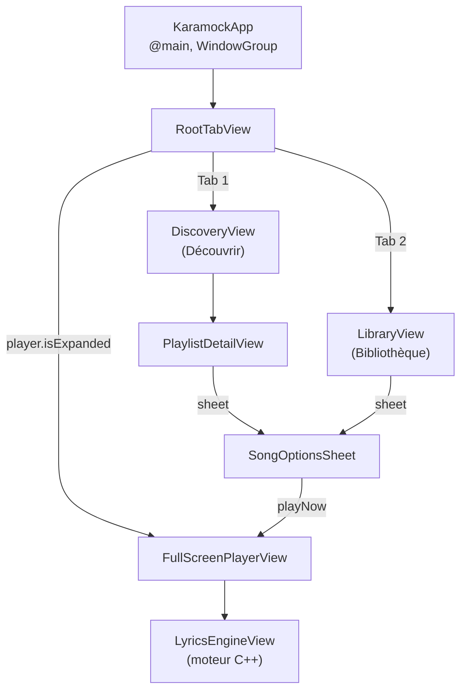
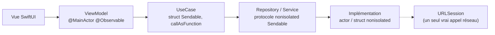
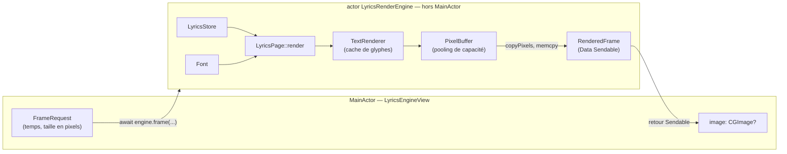

# Architecture de Karamock

> Document de référence décrivant le fonctionnement interne de l'application — écrans, couches, appels réseau, concurrence Swift 6 et moteur de rendu C++. Rédigé à partir du code réel du dépôt (état au 11 août 2026, §9/§13 rafraîchies après le batch de correctifs de performance du 10 août 2026).

## Sommaire

1. [Vue d'ensemble](#1-vue-densemble)
2. [Écrans de l'application](#2-écrans-de-lapplication)
3. [Architecture en couches](#3-architecture-en-couches)
4. [Injection de dépendances](#4-injection-de-dépendances)
5. [Couche Domain](#5-couche-domain)
6. [Repositories et Services](#6-repositories-et-services)
7. [Appel réseau](#7-appel-réseau)
8. [Concurrence Swift 6](#8-concurrence-swift-6)
9. [Le moteur de paroles en C++](#9-le-moteur-de-paroles-en-c)
10. [Tests](#10-tests)
11. [Configuration du projet](#11-configuration-du-projet)
12. [Accessibilité](#12-accessibilité)
13. [Limites connues et hors périmètre](#13-limites-connues-et-hors-périmètre)

---

## 1. Vue d'ensemble

Karamock est une reproduction SwiftUI de l'app mobile KaraFun, développée comme projet d'entraînement personnel (voir `MISSION.md`) — pas un produit destiné à être publié. Toutes les données (chansons, playlists, paroles hors appel réseau) sont mockées localement ; aucun vrai moteur audio n'existe, la lecture est entièrement simulée.

**Plateformes** : iOS et tvOS, une seule base de code, une seule target `Karamock` + une target de tests `KaramockTests`. `TARGETED_DEVICE_FAMILY = "1,2,3"` (iPhone, iPad, Apple TV).

**Stack** :
- SwiftUI pour toute l'interface, sur les deux plateformes, avec divergence ciblée via `#if os(iOS)` / `#if os(tvOS)` plutôt que deux bases de code séparées.
- Swift 6 en mode strict (`SWIFT_VERSION = 6.0`, `SWIFT_DEFAULT_ACTOR_ISOLATION = MainActor`).
- [Factory](https://github.com/hmlongco/Factory) (`FactoryKit`) comme conteneur d'injection de dépendances — composition root unique dans `KaramockContainer.swift`.
- Un moteur de rendu de paroles écrit en C++ (interop Swift/C++ native, `objcxx`), qui rastérise lui-même le texte pixel par pixel plutôt que de s'appuyer sur `Text` SwiftUI.
- Swift Testing (`@Test`/`#expect`) pour les tests unitaires.

**Architecture générale** : `Vue → ViewModel (@MainActor) → UseCase (struct Sendable) → Repository/Service (protocole Sendable) → implémentation concrète (actor / struct / moteur C++)`. Une seule couche a le droit de dépendre de la suivante ; le Domain ne connaît ni SwiftUI ni les détails d'implémentation réseau.

---

## 2. Écrans de l'application



| Écran | Fichier | Rôle | ViewModel | Présentation |
|---|---|---|---|---|
| `RootTabView` | `Views/RootTabView.swift` | Racine : TabView 2 onglets + mini-lecteur + lecteur plein écran | — (lit `PlayerState`) | Scène racine (`WindowGroup`) |
| `DiscoveryView` | `Views/Discovery/DiscoveryView.swift` | Onglet "Découvrir" : liste de playlists | — | Onglet 1, `NavigationStack` propre |
| `PlaylistDetailView` | `Views/Discovery/PlaylistDetail/PlaylistDetailView.swift` | Détail playlist, liste de chansons | — (état local) | `navigationDestination(for: Playlist.self)` |
| `SongOptionsSheet` | `.../SongOptionSheet/SongOptionsSheet.swift` | Choix Karaoké/Battle, chanteur, pitch/tempo, téléchargement | `SongOptionsViewModel` | `.sheet(item:)` depuis Library et PlaylistDetail |
| `LibraryView` | `Views/Library/LibraryView.swift` | Onglet "Bibliothèque" : chansons téléchargées | `LibraryViewModel` (`@InjectedObservable`) | Onglet 2, `NavigationStack` propre |
| `FullScreenPlayerView` | `Views/Player/FullScreenPlayer/FullScreenPlayerView.swift` | Lecteur plein écran : paroles, scrub, transport | `FullScreenPlayerViewModel` | `.fullScreenCover` (iOS) / `.navigationDestination(isPresented:)` (tvOS) |
| `LyricsEngineView` | `Views/Player/FullScreenPlayer/LyricsEngineView.swift` | Rendu des paroles via le moteur C++ | — (reçoit `lyrics: [LyricsLine]`/`currentTime`, délègue le rendu à l'acteur `LyricsRenderEngine`) | Intégrée dans FullScreenPlayerView, dans un `TimelineView(.animation(paused:))` |
| `MiniPlayerBar` | `Views/Player/MiniPlayerBar/MiniPlayerBar.swift` | Mini-lecteur compact/étendu (iOS uniquement) | — (lit `PlayerState`) | `.tabViewBottomAccessory` |
| `MiniPlayerBarTV` | `Views/Player/MiniPlayerBar/MiniPlayerBarTV.swift` | Équivalent tvOS, carte focusable | — (lit `PlayerState`) | `.overlay` + `.focusSection()` |

### Divergences iOS / tvOS notables

| Sujet | iOS | tvOS |
|---|---|---|
| Navigation du lecteur | `.fullScreenCover(isPresented:)` | `.navigationDestination(isPresented:)` (dans un `NavigationStack` racine) |
| Mini-lecteur | `MiniPlayerBar` en `.tabViewBottomAccessory`, `.tabBarMinimizeBehavior(.onScrollDown)` | `MiniPlayerBarTV` en `.overlay` + `.focusSection()` (pas d'API bottom-accessory sur tvOS `TabView`) |
| Réglages pitch/tempo | `Slider` | `FocusStepperTV` (boutons +/-, un remote ne "drague" pas bien un slider) |
| Scrub de lecture | `Slider(value:in:)` | `FocusStepperTV` (pas à pas de 10s) |
| Pull-to-refresh (Bibliothèque) | `.refreshable` | absent (non pertinent sur tvOS) |
| Bouton lecture/pause remote | — | `.onPlayPauseCommand { player.isPlaying.toggle() }` (Siri Remote) |
| Header extensible | effet rubber-band via `.stretchy()` | no-op (extension conditionnelle) |
| `ModeCard` sélectionné | fond couleur plat | `.regularMaterial` + anneau — plus lisible pour la mise en évidence du focus engine |

**Point d'entrée** : `Views/KaramockApp.swift` est volontairement minimal — un seul `WindowGroup { RootTabView() }`, aucun `.environment()` injecté à ce niveau. Toute résolution de dépendance passe par le conteneur Factory (`@Injected`/`@InjectedObservable`/`Container.shared.*`), jamais par `environmentObject`.

---

## 3. Architecture en couches



Chaque flèche ne connaît que le niveau juste en dessous d'elle — une vue n'appelle jamais un Repository directement, un UseCase ne connaît jamais SwiftUI. Les ViewModels reçoivent des **UseCases** en injection, pas des Repositories bruts (exception : `SongOptionsViewModel`, qui reçoit `PlayerState`, un état partagé, pas un UseCase — voir §5).

Les quatre ViewModels de l'app (`FullScreenPlayerViewModel`, `LibraryViewModel`, `SongDownloadViewModel`, `SongOptionsViewModel`) et l'état partagé `PlayerState` sont tous `@MainActor @Observable final class` — cohérent avec `SWIFT_DEFAULT_ACTOR_ISOLATION = MainActor` (§8).

---

## 4. Injection de dépendances

Composition root unique : `KaramockContainer.swift`, une extension de `Container` (FactoryKit) exposant des `Factory<T>`/`ParameterFactory<Param, T>`.

| Registration | Durée de vie | Protocole/type | Implémentation |
|---|---|---|---|
| `lyricsFetching` | nouvelle instance | `LyricsFetching` | `URLSessionLyricsFetching` |
| `lyricsRepository` | **`.singleton`** | `LyricsRepository` | `CachedLyricsRepository` (actor) |
| `downloadedSongsRepository` | **`.singleton`** | `DownloadedSongsRepository` | `InMemoryDownloadedSongsRepository` (actor) |
| `songDownloading` | nouvelle instance | `SongDownloading` | `SimulatedSongDownloading` |
| `fetchLyrics` | nouvelle instance | `FetchLyricsUseCase` | — |
| `downloadSong` | nouvelle instance | `DownloadSongUseCase` | — |
| `fetchDownloadedSongs` | nouvelle instance | `FetchDownloadedSongsUseCase` | — |
| `player` | **`.singleton`**, `@MainActor` | `PlayerState` | état partagé de l'app |
| `fullScreenPlayerViewModel` | `ParameterFactory<Song, _>`, `@MainActor` | `FullScreenPlayerViewModel` | — |
| `libraryViewModel` | nouvelle instance, `@MainActor` | `LibraryViewModel` | — |
| `songDownloadViewModel` | `ParameterFactory<Song, _>`, `@MainActor` | `SongDownloadViewModel` | — |
| `songOptionsViewModel` | `ParameterFactory<Song, _>`, `@MainActor` | `SongOptionsViewModel` | compose `player` + `songDownloadViewModel(song)` |

Les deux Repositories sont `.singleton` — logique, puisqu'ils encapsulent un état mutable partagé (cache de paroles, liste des chansons téléchargées) que toute l'app doit voir de façon cohérente. Les Services et UseCases, sans état, sont recréés à chaque résolution sans coût réel.

**Consommation côté vues** : `@Injected(\.player)` pour l'état partagé ; `@InjectedObservable(\.libraryViewModel)` pour un ViewModel sans paramètre runtime ; résolution directe `Container.shared.xxxViewModel(song)` dans un `.task { }` quand un paramètre runtime (`Song`) est nécessaire (`SongOptionsSheet`, `FullScreenPlayerView`).

*Dépendance externe* : Factory est déclarée sur la branche `main` du dépôt GitHub (`requirement = { branch = main }`), pas sur un tag de version figé — à surveiller, une mise à jour de la dépendance peut introduire un changement de comportement sans changement de version visible.

---

## 5. Couche Domain

Entièrement composée de types valeur immuables (`struct`/`enum`, champs `let`), donc `Sendable` par construction — thread-safe sans effort.

### Modèles (`Domain/Models/`)

| Type | Champs | Remarque |
|---|---|---|
| `Song` | `title, artist, year, duration: String, key` | `id` est **calculé** (`"\(artist.lowercased())-\(title.lowercased())"`), pas un UUID — deux chansons de même artiste/titre partagent la même identité (voir `SongIdentityTests`). Étendu par `Song+Duration.swift` (`durationInSeconds`, `nonisolated`). |
| `Playlist` | `id: UUID, title, songs: [Song]` | `id` est un UUID aléatoire par instance, contrairement à `Song`. |
| `LyricsLine` | `id: UUID, time: TimeInterval, text: String` | Le même fichier expose `placeholderLyrics`, le jeu de repli affiché avant tout chargement réel. |
| `LyricsError: Error, Sendable` | `.invalidURL`, `.notFound`, `.network`, `.malformedResponse` | Seule erreur domaine de production, consommée via `throws(LyricsError)` (typed throw) de bout en bout. |
| `DownloadState` | `.notDownloaded`, `.downloading(progress:)`, `.downloaded`, `.failed` | Machine à états du téléchargement simulé. |
| `KaraokeMode` | `.karaoke`, `.battle` (`String` raw value) | Enum d'affichage pur, sans logique. |

### Use cases (`Domain/Use Case/`)

Tous : `struct : Sendable`, `nonisolated init`, exposés via `callAsFunction` (appel comme une fonction plutôt qu'une méthode `.execute()`).

- **`FetchLyricsUseCase`** — délégation pure vers `LyricsRepository.lyrics(for:)`.
- **`FetchDownloadedSongsUseCase`** — délégation pure vers `DownloadedSongsRepository.songs()`.
- **`DownloadSongUseCase`** — le plus complexe : orchestre un `SongDownloading` (flux de progression) et un `DownloadedSongsRepository`, ne persiste la chanson qu'après un flux terminé **avec succès et sans annulation**. Construit son propre `AsyncThrowingStream`, propage l'annulation via `continuation.onTermination`.

### Mapper (`Domain/Mappers/LyricsMapper.swift`)

`nonisolated enum` sans cas, utilisé comme espace de noms pour une fonction statique pure : découpe le texte brut de lyrics.ovh en lignes (séparateur `\n`), puis répartit chaque ligne uniformément sur `durationInSeconds` de la chanson pour produire des `[LyricsLine]` horodatées. C'est ici, pas dans la vue ni le service réseau, que vit la règle "paroles simulées à intervalle uniforme" actée dans `MISSION.md`.

### Interfaces (`Domain/Interfaces/`)

Toutes `nonisolated protocol ... : Sendable` — permet à un `actor` comme à un `struct` de s'y conformer sans conflit d'isolation.

| Protocole | Dossier | Signature |
|---|---|---|
| `LyricsRepository` | `Repositories/` | `func lyrics(for: Song) async throws(LyricsError) -> [LyricsLine]` |
| `DownloadedSongsRepository` | `Repositories/` | `func songs() async -> [Song]` / `func add(_ song: Song) async` |
| `LyricsFetching` | `Services/` | `func fetchLyrics(artist:title:) async throws(LyricsError) -> String` |
| `SongDownloading` | `Services/` | `func download(_ song: Song) -> AsyncThrowingStream<Double, Error>` |

Convention de nommage : **Repository** agrège/persiste des objets domaine ; **Service** (nommé au gérondif, `*Fetching`/`*Downloading`) enveloppe une capacité externe ou simulée brute. `LyricsRepository` décore un `LyricsFetching` (cache par-dessus une source de données), pattern classique repository-décore-service.

---

## 6. Repositories et Services

| Type | Fichier | Nature | Rôle |
|---|---|---|---|
| `CachedLyricsRepository` | `Repositories/CachedLyricsRepository.swift` | `actor` | Cache en mémoire `[Song.ID: [LyricsLine]]` ; sur cache miss, appelle `LyricsFetching`, transforme via `LyricsMapper`, met en cache. |
| `InMemoryDownloadedSongsRepository` | `Repositories/InMemoryDownloadedSongsRepository.swift` | `actor` | Stockage `[Song]` en mémoire (perdu à chaque relance de l'app) ; `add` dé-doublonne via `Song: Hashable`. |
| `URLSessionLyricsFetching` | `Services/URLSessionLyricsFetching.swift` | `nonisolated struct` | **Le seul vrai appel réseau de l'app** — détaillé au §7. |
| `SimulatedSongDownloading` | `Services/SimulatedSongDownloading.swift` | `struct` | Téléchargement entièrement simulé : 10 paliers × 200 ms (`Task.sleep`), aucune I/O réelle. |

Aucun de ces types n'a de contrepartie mock en dehors de la target de tests (`MockDownloadedSongsRepository`, `MockSongDownloading` — voir §10).

---

## 7. Appel réseau

**Le seul vrai appel réseau de toute l'application** vit dans `Services/URLSessionLyricsFetching.swift` : récupération des paroles depuis l'API publique [lyrics.ovh](https://lyrics.ovh/). Tout le reste (chansons, playlists, téléchargement) est mocké en local, conformément à `MISSION.md`.

```
GET https://api.lyrics.ovh/v1/{artist percent-encodé}/{title percent-encodé}
```

Utilise `URLSession.shared.data(from:)` (pas de `URLRequest` custom, pas d'en-têtes). Déroulé :

1. Construction de l'URL — échec de l'encodage → `LyricsError.invalidURL`.
2. `URLSession.shared.data(from:)` — erreur réseau (journalisée via `os.Logger`) → `LyricsError.network`.
3. Cast en `HTTPURLResponse` — échec → `LyricsError.malformedResponse`.
4. Code `404` → `LyricsError.notFound` (signal "paroles introuvables" de lyrics.ovh).
5. Code hors `200...299` → `LyricsError.network`.
6. `JSONDecoder().decode(LyricsResponse.self, from: data).lyrics` — échec de décodage → `LyricsError.malformedResponse`.

```swift
nonisolated private struct LyricsResponse: Decodable { let lyrics: String }
```

`LyricsError` traverse ensuite `CachedLyricsRepository` → `LyricsRepository` → `FetchLyricsUseCase` → `FullScreenPlayerViewModel.loadLyrics()`, où chaque cas est converti en une ligne de paroles de repli affichée à l'utilisateur :

| Cas | Message affiché |
|---|---|
| `.notFound` | "Paroles indisponibles pour cette chanson." |
| `.network` | "Connexion impossible. Réessayez" |
| `.invalidURL`, `.malformedResponse` | "Paroles indisponibles pour le moment." |

Important : ce message de repli est ensuite envoyé au moteur C++ comme n'importe quelle ligne réelle (voir §9) — l'échec réseau ne laisse donc jamais le rendu de paroles vide, seule la fenêtre de chargement elle-même (avant la fin de `loadLyrics()`) l'est.

---

## 8. Concurrence Swift 6

### Réglages du projet

- `SWIFT_VERSION = 6.0` (target `Karamock`) — mode Swift 6 complet, vérification stricte de la concurrence activée par défaut.
- `SWIFT_DEFAULT_ACTOR_ISOLATION = MainActor` — **toute déclaration sans annotation explicite est implicitement `@MainActor`**. C'est la clé de lecture de tout le reste : les vues SwiftUI n'ont jamais besoin d'un `@MainActor` explicite, seuls les types qui doivent délibérément *sortir* de cette isolation par défaut sont annotés.
- `SWIFT_APPROACHABLE_CONCURRENCY = YES`.
- ⚠️ La target `KaramockTests` tourne en **`SWIFT_VERSION = 5.0`**, sans `SWIFT_DEFAULT_ACTOR_ISOLATION` — une incohérence réelle : les tests ne s'exécutent pas sous le même mode de langage strict que l'app elle-même.

Aucune occurrence de `Task.detached`, `@unchecked Sendable` ou `nonisolated(unsafe)` dans toute la target `Karamock` — la concurrence repose uniquement sur `actor`, `@MainActor`, `nonisolated`/`Sendable` et `Task` structuré. C'est une base de code "propre" au sens strict-concurrency, sans échappatoire.

### Carte des stratégies d'isolation

| Stratégie | Utilisée pour | Exemples |
|---|---|---|
| `@MainActor @Observable final class` | ViewModels + état UI partagé | `FullScreenPlayerViewModel`, `LibraryViewModel`, `SongDownloadViewModel`, `SongOptionsViewModel`, `PlayerState`, `PlaybackClock` |
| `actor` | Repository avec état mutable partagé, ou état hors-UI qui ne doit pas bloquer le thread principal | `CachedLyricsRepository` (cache), `InMemoryDownloadedSongsRepository` (liste), `LyricsRenderEngine` (moteur C++ persistant — voir §9) |
| `nonisolated struct/protocol : Sendable` | Domain (UseCases, protocoles, mapper), Service sans état, DTO traversant une frontière d'acteur | `FetchLyricsUseCase`, `LyricsRepository` (protocole), `LyricsMapper`, `URLSessionLyricsFetching`, `LyricsLinePayload`/`RenderedFrame` |
| Valeur immuable (`let` uniquement) | Modèles domaine | `Song`, `Playlist`, `LyricsLine`, `LyricsError` |
| `Task { }` structuré, référence conservée | Travail asynchrone annulable depuis un ViewModel | `SongDownloadViewModel.downloadTask: Task<Void, Never>?`, annulé dans `cancelDownload()` |
| `Task { }` interne à un flux | Pont entre un service générateur et un `AsyncThrowingStream` | `DownloadSongUseCase.callAsFunction`, `SimulatedSongDownloading.download` |
| `.task { }` (modifier SwiftUI) | Déclenchement asynchrone lié au cycle de vie d'une vue | `LyricsEngineView` (chargement police + paroles + rendu coalescé, 3 `.task` distincts), `LibraryView` (`refresh()`), `SongOptionsSheet` (résolution DI paramétrée) |

Cette carte donne la règle de conception implicite du projet, documentée aussi dans `docs/swift6-isolation-bonnes-pratiques.md` : **`@MainActor` réservé à ce qui pilote directement l'UI ; tout le reste (Domain, Repository, Service) reste `nonisolated` ou isolé dans son propre `actor`.** Un Repository n'est jamais `@MainActor` — décision explicitement corrigée par Nicolas tôt dans le projet (voir `learning-records/0004-repository-ne-doit-pas-etre-mainactor.md`) : un Repository fait de l'I/O et ne doit jamais bloquer le thread principal. `LyricsRenderEngine` (§9) applique la même règle à un nouveau cas : un moteur de rendu qui fait un travail CPU non négligeable ne doit pas non plus tourner sur `@MainActor`, même s'il ne fait aucune I/O.

---

## 9. Le moteur de paroles en C++

Depuis la Leçon 35 (interop Swift/C++), l'affichage des paroles n'est plus géré par SwiftUI (`Text` + `ScrollView`) mais par un petit moteur de rendu logiciel écrit en C++, intégré via l'interop Swift/C++ native (pas de pont Objective-C).

### Configuration d'interop

- `SWIFT_OBJC_INTEROP_MODE = objcxx`
- `CLANG_CXX_LANGUAGE_STANDARD = "gnu++20"`
- Bridging header (`Karamock-Bridging-Header.h`) — 5 en-têtes C++ exposés à Swift :
  ```
  Engine/LyricsStore.hpp
  Engine/PixelBuffer.hpp
  Engine/Font.hpp
  Engine/TextRenderer.hpp
  Engine/LyricsPage.hpp
  ```
- Côté Swift : `import CxxStdlib`, tous les types C++ accessibles sous le namespace `karamock.*` (ex. `karamock.LyricsStore()`), toute `String` Swift passée à un `std::string` nécessite un cast explicite `std.string(_:)`.

### Pipeline de rendu (depuis le 10 août 2026 : rendu hors MainActor)

Le rendu ne tourne plus sur le thread principal. `LyricsRenderEngine` (`Engine/LyricsRenderEngine.swift`) est un **`actor`** Swift qui possède, de façon persistante d'une frame à l'autre, l'intégralité de l'état C++ du moteur (`Font`, `LyricsStore`, `TextRenderer`, `LyricsPage`, `PixelBuffer`) — plus aucun de ces objets n'est reconstruit à chaque rendu. `LyricsEngineView`, elle, reste `@MainActor` (comme toute vue SwiftUI) mais ne fait plus le rendu elle-même : elle envoie une requête à l'acteur et n'échange avec lui que des types `Sendable`.



| Composant | Fichier(s) | Rôle |
|---|---|---|
| `LyricsRenderEngine` | `Engine/LyricsRenderEngine.swift` | **`actor`**, hors MainActor. Possède l'état C++ persistant (`font`, `store`, `renderer`, `page`, `buffer`, réutilisés d'un appel à l'autre). `loadFontIfNeeded`, `setLyrics([LyricsLinePayload])`, `frame(at:pixelWidth:pixelHeight:) -> RenderedFrame?` — seule méthode qui rastérise, retourne un DTO `Sendable`, jamais un pointeur ou un type C++. |
| `LyricsLinePayload` / `RenderedFrame` | `Domain/DTO/LyricsRenderTypes.swift` | `nonisolated struct : Sendable`. Les seuls types qui traversent la frontière d'acteur `LyricsEngineView` ↔ `LyricsRenderEngine` — `Data`/`Int`/`Double`/`String` uniquement, jamais un `karamock.*` (les types C++ ne franchissent jamais cette frontière). |
| `LyricsStore` | `Engine/LyricsStore.hpp/.cpp` | Collection `LyricLine{time, text}` horodatée, propriété de l'acteur. `textAt`/`indexAtTime` (recherche binaire `std::upper_bound`, sentinel `npos`). `addLine` vérifie (`assert`) que les temps sont croissants. |
| `Font` | `Engine/Font.hpp/.cpp` | Pimpl autour de `stbtt_fontinfo` (stb_truetype). **Move-only** (`Font(const Font&) = delete`) — chargée une fois (`loadFontIfNeeded`), vit dans l'acteur pour toute la durée de vie de la vue. |
| `TextRenderer` | `Engine/TextRenderer.hpp/.cpp` | **Cache de glyphes** (`glyphCache_: unordered_map<uint64_t, CachedGlyph>`, clé = codepoint + hauteur en pixels arrondie) — un glyphe n'est rastérisé (`stbtt_MakeCodepointBitmap`) qu'une seule fois, puis relu depuis le cache à chaque frame suivante. `hmetricsCache_` (`mutable`) fait de même pour les métriques utilisées par `measureWidth` (`const`). |
| `PixelBuffer` | `Engine/PixelBuffer.hpp/.cpp` | Buffer RGBA8. `resize` ne réalloue que si la capacité existante est insuffisante (pooling) plutôt que de désallouer/réallouer à chaque frame. `copyPixels(dest, capacity)` copie le contenu par `memcpy` **à l'intérieur du C++**, où `pixels_` reste valide — remplace un accès direct au pointeur brut `__dataUnsafe()` qui provoquait un use-after-free (voir plus bas). |
| `LyricsPage` | `Engine/LyricsPage.hpp/.cpp` | Inchangée depuis la Leçon 41 : trouve la ligne active, dessine trois lignes avec transition de position lissée (`easeOutCubic`, `0.5s`), sans état mutable propre. |
| `LyricsEngineView` | `Views/Player/FullScreenPlayer/LyricsEngineView.swift` | `@State private var engine = LyricsRenderEngine()`. Construit une `FrameRequest` (temps en ms, taille en pixels) à partir de `currentTime`/`size`/`displayScale`, et l'envoie via `.task(id: request)`. Rendu **coalescé** (voir plus bas). `Image(...).resizable()` pour occuper toute la largeur mesurée. |
| `PlaybackClock` | `Views/Player/FullScreenPlayer/PlaybackClock.swift` | `@MainActor @Observable`, hors du moteur C++. Horloge continue ancrée sur `CACurrentMediaTime()` (`anchorMedia`/`anchorHost`) plutôt qu'un compteur avancé par pas de 0,5s — `currentTime()` interpole en continu entre deux resynchronisations (`sync(to:running:)`, appelée au démarrage, à play/pause, et sur scrub manuel). |

**D'où vient `currentTime` maintenant** : `FullScreenPlayerView` enveloppe `LyricsEngineView` dans un `TimelineView(.animation(minimumInterval: nil, paused: !player.isPlaying))`, qui redessine au rythme d'affichage de l'appareil (pas un minuteur à 0,5s) et lui passe `min(clock.currentTime(), song.durationInSeconds)`. Le `Timer.publish(every: 0.5)` existe toujours dans `FullScreenPlayerView`, mais ne sert plus qu'à faire progresser `progress` (le slider affiché) et à détecter la fin de piste — la fluidité visuelle du moteur ne dépend plus de lui.

**Rendu coalescé** (`LyricsEngineView.renderCurrent()`) : un seul appel `await engine.frame(...)` en vol à la fois. Si un nouveau tick de `TimelineView` arrive pendant qu'un rendu est déjà en cours, sa requête remplace simplement `pendingRequest` (la plus récente l'emporte) plutôt que d'empiler un nouvel appel sur la boîte aux lettres FIFO de l'acteur — sans ça, un acteur plus lent que la cadence des ticks accumule un backlog croissant et le rendu affiché prend un retard grandissant sur le temps réel.

### Bug corrigé : use-after-free sur `__dataUnsafe()`

Avant le correctif du 10 août 2026, le premier jet du rendu par acteur récupérait le buffer via `buffer.__dataUnsafe()` puis le copiait dans une `Data` Swift — sûr en synchrone (Leçons 37-42), mais devenu un **use-after-free** une fois `PixelBuffer` manipulé à travers l'interop asynchrone de l'acteur : le buffer C++ pouvait être matérialisé comme temporaire et détruit en fin d'instruction avant que la copie ne soit terminée, provoquant un crash `EXC_BAD_ACCESS`. Corrigé en ajoutant `PixelBuffer::copyPixels(uint8_t* destination, size_t capacity) const`, qui fait le `memcpy` **entièrement à l'intérieur du C++** (où `pixels_` est garanti valide) — plus aucun pointeur brut ne traverse la frontière Swift/C++ pour ce buffer. Rappel utile : ce n'est pas un problème du pattern `__dataUnsafe()` lui-même (toujours valide en appel synchrone direct), mais de sa combinaison avec l'asynchronisme d'un acteur — un rappel que les invariants "sûrs en synchrone" doivent être revérifiés dès qu'un `await` s'intercale.

### Point d'attention introduit par le pooling de `PixelBuffer`

`sizeInBytes()` (`= pixels_.size()`) **n'est plus garanti égal à `width() * height() * 4`** après un rétrécissement de frame qui suit un frame plus grand : `resize()` ne réalloue (et donc ne met à jour `pixels_.size()`) que si la capacité existante est insuffisante — en cas de rétrécissement, la capacité reste suffisante, `resize()` ne fait rien, et `pixels_.size()` garde sa valeur précédente (plus grande). Aucun bug visible aujourd'hui : le seul appelant (`LyricsRenderEngine.frame()`) combine toujours `sizeInBytes()` avec `width()`/`height()`/`bytesPerRow()` (issus de `width_`/`height_`, eux toujours à jour) pour construire le `CGImage`, donc l'excédent de mémoire copié n'est jamais lu au-delà des dimensions réelles. Mais tout futur appelant qui supposerait `sizeInBytes() == width()*height()*4` obtiendrait une valeur obsolète après un rétrécissement — à garder en tête avant d'ajouter un nouveau consommateur de `PixelBuffer`.

### Points d'attention interop Swift/C++ (récurrents dans le code)

- `Int`/`Int32` : une valeur Swift `Int` non littérale doit être castée explicitement en `Int32` pour un paramètre C++ `int` ; un littéral entier se convertit implicitement.
- `Double` : contrairement à `Int`, un `Double` Swift (littéral ou non) se convertit directement vers/depuis un `double` C++, sans cast.
- Un type C++ (`karamock.Font`, `karamock.PixelBuffer`...) ne doit jamais traverser une frontière d'acteur/async directement — seuls des types `Sendable` purement Swift (`Data`, `Int`, `String`...) le peuvent, comme le montre `RenderedFrame`.
- `std::vector`/conteneurs C++ lus depuis Swift n'ont aucune garantie de performance documentée (copie profonde possible) — le moteur ne construit donc jamais de `std::vector` côté Swift ; c'est le C++ qui possède ses propres conteneurs, alimentés ligne par ligne (`addLine`).

---

## 10. Tests

Framework : **Swift Testing** (`@Test`, `#expect`), target `KaramockTests`, avec `FactoryTesting` (`@Suite(.container)`) pour substituer des doubles de test dans le conteneur Factory par test.

| Fichier | Couvre | Nb. tests |
|---|---|---|
| `LibraryViewModelTests.swift` | `LibraryViewModel` (chargement, cas vide) | 2 |
| `SongDownloadCancellationTests.swift` | Annulation en cours de téléchargement (aucune persistance) | 1 |
| `SongDownloadFailureTests.swift` | Transition vers l'état `.failed` | 1 |
| `SongIdentityTests.swift` | Identité `Song` (même artiste+titre ⇒ même identité) | 1 |

Doubles de test : `MockDownloadedSongsRepository` (`actor`, sans dé-doublonnage contrairement à l'implémentation réelle) et `MockSongDownloading` (`struct`, échec simulé injectable au palier 5/10).

Aucun test n'existe pour la couche réseau (`URLSessionLyricsFetching`), le mapper (`LyricsMapper`) ou le moteur C++ — la couverture actuelle se concentre sur les ViewModels liés au téléchargement et à la bibliothèque.

---

## 11. Configuration du projet

- Xcode "Tools Version 26.6", `objectVersion = 77`, groupes de fichiers synchronisés (`PBXFileSystemSynchronizedRootGroup`) plutôt que liste de fichiers explicite.
- `IPHONEOS_DEPLOYMENT_TARGET = 26.5`, `TVOS_DEPLOYMENT_TARGET = 26.0`.
- `SUPPORTS_MACCATALYST = NO`.
- Bundle IDs : `fr.nicolaslinard.Karamock` (app), `fr.nicolaslinard.KaramockTests` (tests).
- Dépendance externe unique : **Factory** (`FactoryKit` + `FactoryTesting`), suivie sur la branche `main` du dépôt GitHub — pas de `Package.swift` (le projet est un `.xcodeproj` classique, pas un package SPM).
- Code tiers vendorisé : `Engine/ThirdParty/stb_truetype.h` + `stb_truetype_impl.cpp` (rasterisation de police, domaine public/MIT). Ressources : `NotoSans-Regular.ttf`, `NotoSans-Bold.ttf`, `OFL.txt` (licence SIL Open Font, obligation de redistribution respectée).

---

## 12. Accessibilité

Concentrée sur le lecteur et les composants de navigation ; aucune gestion de "Reduce Motion" nulle part dans le code.

| Écran | Fonctionnalité |
|---|---|
| `FullScreenPlayerView` | `.accessibilityLabel` sur les 4 boutons de transport ; `@ScaledMetric(relativeTo: .largeTitle)` sur la taille du bouton lecture (Dynamic Type). |
| `MiniPlayerBar` | Titre/artiste fusionnés en un seul élément d'accessibilité avec trait `.isButton` et une `.accessibilityAction` dédiée pour ouvrir le lecteur plein écran (une seule cible VoiceOver plutôt que deux). |
| `MiniPlayerBarTV` | Label composé unique (`"titre, artiste, en lecture/en pause"`) + `.accessibilityHint`. |
| `FocusStepperTV` | Boutons +/- labellisés ("Diminuer"/"Augmenter") — sans ça, illisibles en VoiceOver/focus tvOS (icônes seules). |
| `PlaylistCard` | `.dynamicTypeSize` plafonné à `.accessibility1` (évite de casser la tuile à taille fixe) mais `.accessibilityShowsLargeContentViewer` reste actif pour compenser. |

Les écrans Discovery, PlaylistDetail, SongOptionsSheet/Form et LibraryView n'ont pas de modificateur d'accessibilité explicite — ils reposent sur l'inférence par défaut de SwiftUI (`Text`/`Button`/`Label`).

---

## 13. Limites connues et hors périmètre

Explicitement acté dans `MISSION.md` — pas des oublis :

- **Aucun vrai moteur audio** (pas d'AVAudioEngine/CoreAudio), aucune synchronisation parole-par-parole réelle sur un fichier audio, aucun scoring vocal (mode Battle). La lecture entière (avancement de `progress`, minuterie 0,5s) est simulée.
- **Aucun vrai backend** ni vraie recherche de chansons — seul l'appel à lyrics.ovh (§7) touche un vrai service externe.
- Projet strictement personnel, non destiné à publication ou usage commercial.

Limites techniques réelles, découvertes et documentées au fil des leçons plutôt que dans `MISSION.md` :

- **Texte ASCII uniquement** : `TextRenderer` itère toujours `std::string` octet par octet (`unsigned char`), pas codepoint Unicode — un caractère accentué UTF-8 multi-octets (é, è, à...) produit un glyphe cassé. Non traité par le batch de correctifs du 10 août 2026 (qui a porté sur la performance, pas l'Unicode) — toujours un problème réel pour des paroles françaises.
- **`sizeInBytes()` potentiellement obsolète après un rétrécissement de frame** (voir §9) : conséquence du pooling introduit le 10 août 2026 sur `PixelBuffer::resize`. Sans conséquence visible aujourd'hui, mais un piège pour un futur appelant qui ferait l'hypothèse `sizeInBytes() == width()*height()*4`.
- **`FullScreenPlayerViewModel.lyricsStore` et `sendLyricsToEngine()` devenus du code mort** : depuis que `LyricsEngineView` reçoit directement `lyrics: [LyricsLine]` et construit son propre `karamock.LyricsStore` à l'intérieur de l'acteur `LyricsRenderEngine` (`setLyrics`), plus rien ne lit `viewModel.lyricsStore`. À supprimer par cohérence — même risque de confusion "quel LyricsStore fait autorité" déjà signalé pour `LyricsView.swift` en Leçon 42.
- **`KaramockTests` en Swift 5.0** alors que la target app est en Swift 6.0 — les tests ne bénéficient pas de la même vérification stricte de concurrence que le code qu'ils testent.
- **Dépendance Factory non figée** (suivie sur `main`, pas un tag de version) — un risque de dérive silencieuse de comportement à une mise à jour.

**Résolu depuis la rédaction initiale de ce document (11 août 2026)** — le batch de correctifs de performance du 10 août 2026 (`learning-records/2026-08-10-fix-*.md`) a traité, avec des résultats corrects et vérifiés dans le code, trois points identifiés par l'audit du 8 août 2026 (`audits/2026-08-08-cpp-engine-performance-audit.md`) : rendu déplacé hors MainActor dans un `actor` dédié (§9), cache de glyphes dans `TextRenderer` (§9), pooling de capacité dans `PixelBuffer::resize` (§9, avec une réserve — voir ci-dessus). Le correctif du rendu hors MainActor a d'ailleurs confirmé, en le résolvant correctement, le point que la relecture critique du 9 août 2026 avait anticipé : la solution de l'audit (`Task.detached` capturant des types C++ non-`Sendable`) n'aurait pas compilé telle quelle sous Swift 6 strict concurrency — la solution réellement adoptée (un `actor` persistant, ne faisant traverser que des DTO `Sendable`) contourne ce problème par construction. Au passage, ce même batch a aussi corrigé un vrai use-after-free introduit pendant son propre développement (§9) et le rendu non pleine-largeur du canvas — et, effet de bord positif, le "canvas vide pendant le chargement" documenté dans une version précédente de ce paragraphe a disparu : `LyricsEngineView` reçoit maintenant `viewModel?.lyrics ?? placeholderLyrics`, qui affiche toujours un contenu (paroles réelles ou repli), jamais un canvas vide.
